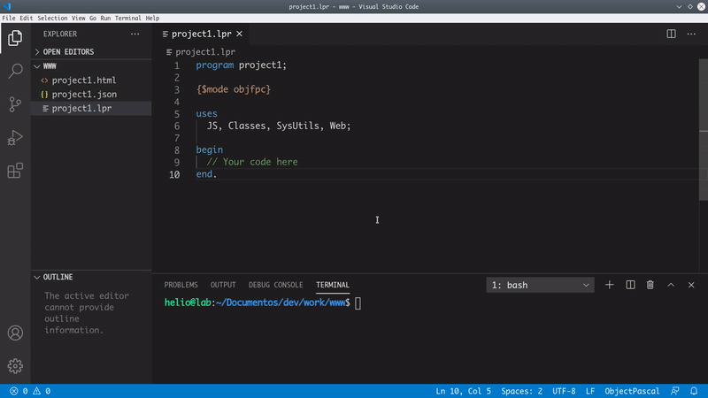
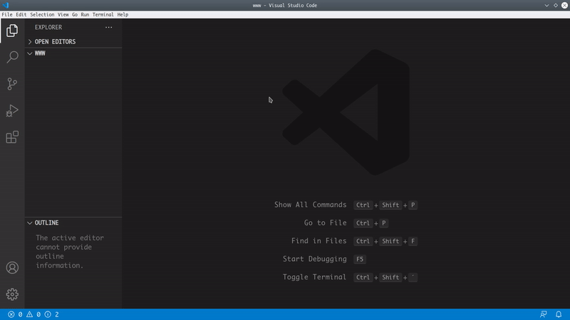
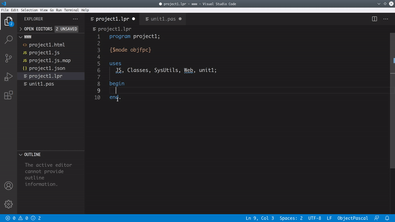

# Pas2JS-VSCode

### Manage your **Pas2JS** Project/Code with Visual Studio Code. 

 
  

## Settings
 

## Features
* ### Project Builder
 

* ### Project Manager
 

* ### Project Settings
 

* ### Code Completion  
 

* ### Code Definition 
 

* ### Code Formatter
 

* ### Code Navigation
 

* ### Code Refactoring
 

* ### Code Suggestion 
 

* ### Snipptes
  

* ### Syntax Coloring 
  

* ### Diagnostics
 

## Dependencies 
CodeTools: https://drive.google.com/file/d/1QFvKgiUyOqOKpzsDvu4N801cYAdPiV-p/view?usp=sharing

Pas2JS: https://wiki.freepascal.org/pas2js#Daily_Snapshots

## Donating

 
  

  

## Credits 
Pas2JS team: https://wiki.freepascal.org/pas2js

Parmaja: https://github.com/parmaja/cliparts 

## License

[MIT](LICENSE.md) &copy; heliosroots 
heliosroots@gmail.com